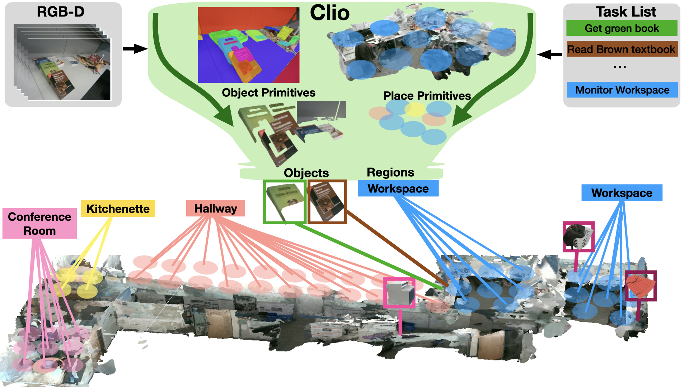
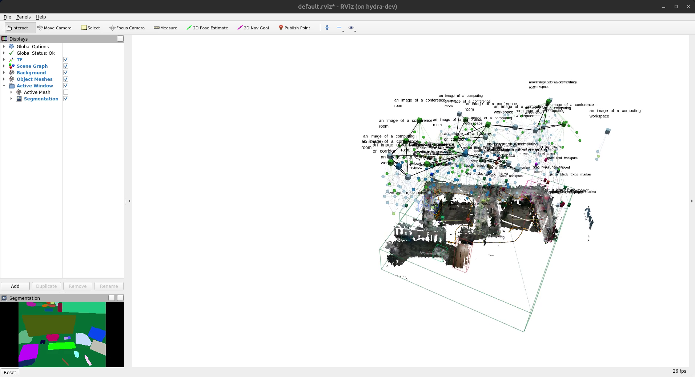
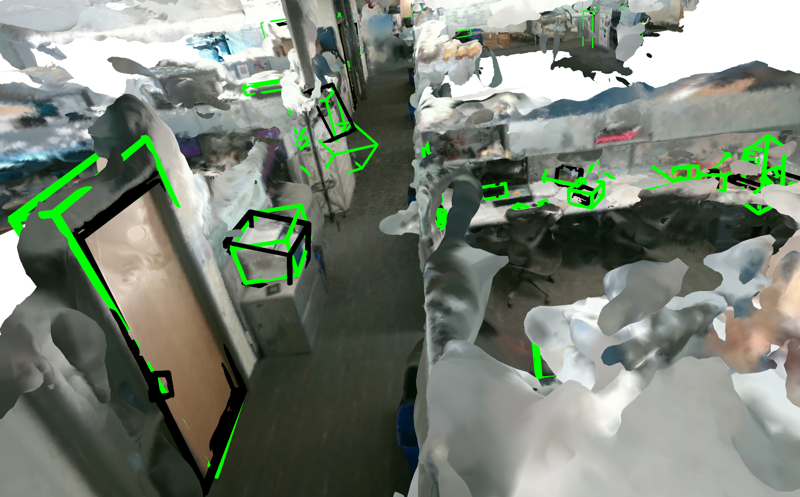

# Clio

This repository contains the code for *Clio: Real-time Task-Driven Open-Set 3D Scene Graphs*.



Clio is a novel approach for building task-driven 3D scene graphs in real-time with open-set semantics. We draw inspiration from the classical Information Bottleneck principle to form task-relevant clusters of object primitives given a set of natural language tasks — such as ''Read brown textbook'' — and by clustering the scene into task-relevant semantic regions such as “Kitchenette” or “Workspace”. The map defines objects and regions at the correct semantic granularity to support tasks relevant for an agent.

# Table of Contents
* [Paper](#Paper)
* [Setup](#Setup)
* [Datasets](#Datasets)
* [Running Clio](#running-clio)
* [Clustering Pre-built Scene Graphs](#clustering-pre-built-scene-graphs)
* [Evaluation](#evaluation)

# Paper

If you find this useful for your research, please consider citing our paper:
* Dominic Maggio, Yun Chang, Nathan Hughes, Matthew Trang, Dan Griffith, Carlyn Dougherty, Eric Cristofalo, Lukas Schmid, Luca Carlone, "**Clio: Real-time Task-Driven Open-Set 3D Scene Graphs**", in IEEE Robotics and Automation Letters, vol. 9, no. 10, pp. 8921-8928, Oct. 2024.  [ [IEEE](https://ieeexplore.ieee.org/document/10659066) | [ArXiv](http://arxiv.org/abs/2404.13696) | [Video](https://www.youtube.com/watch?v=m-HJO10qhSQ) ]

```bibtex
@ARTICLE{Maggio2024Clio,
    title={Clio: Real-time Task-Driven Open-Set 3D Scene Graphs},
    author={Maggio, Dominic and Chang, Yun and Hughes, Nathan and Trang, Matthew and Griffith, Dan and Dougherty, Carlyn and Cristofalo, Eric and Schmid, Lukas and Carlone, Luca},
    journal={IEEE Robotics and Automation Letters},
    year={2024},
    volume={9},
    number={10},
    pages={8921-8928},
    doi={10.1109/LRA.2024.3451395}
}
```

# Setup

We recommend that everyone setup Clio by utilizing ROS.
To install ROS, you can follow the instructions [here](http://wiki.ros.org/ROS/Installation) if you haven't already.

> **Note**</br>
> We also provide a python-only implementation of Clio for offline processing of pre-built scene graphs and evaluation.
> If you want to avoid installing ROS and are only interested in this functionality, you can skip ahead to [these](#installing-without-ros) instructions instead.

### Installing with ROS

<details open>

<summary><b>Initial Requirements</b></summary>

Install the following requirements:
```
sudo apt install python3-rosdep python3-catkin-tools python3-vcstool python3-virtualenv
```

If you haven't set up rosdep yet run:
```
sudo rosdep init
rosdep update
```

</details>

<details open>

<summary><b>Getting and Building Clio</b></summary>

To clone and build Clio, first set up your catkin workspace:
```bash
mkdir -p ~/catkin_ws/src
cd ~/catkin_ws
catkin init
catkin config -DCMAKE_BUILD_TYPE=Release
catkin config --skiplist khronos_eval
```

> **Note**</br>
> By default, one of Clio's dependencies, [semantic_inference](https://github.com/MIT-SPARK/semantic_inference.git), will attempt to build against NVIDIA TensorRT.
> This is not required for Clio, and may cause issues when building if you already have CUDA set up on your system.
> You may wish to disable this by running `catkin config -a -DSEMANTIC_INFERENCE_USE_TRT=OFF` before building.

Then, clone the code and build:
```
cd src
git clone git@github.com:MIT-SPARK/Clio.git clio --recursive
vcs import . < clio/install/clio.rosinstall
rosdep install --from-paths . --ignore-src -r -y

cd ..
catkin build
```

> **Note**</br>
> For the rest of these instructions, we assume that you set up your catkin workspace at `~/catkin_ws`.
> If you used a different workspace path, you should substitute where appropriate.

</details>

<details open>

<summary><b>Setting up Open-Set Segmentation</b></summary>

Make a virtual environment and install:
```bash
python3 -m virtualenv --system-site-packages -p /usr/bin/python3 ~/environments/clio_ros
source ~/environments/clio_ros/bin/activate
pip install ~/catkin_ws/src/semantic_inference/semantic_inference[openset]
deactivate
```

> **Warning** :warning:</br>
> `--system-site-packages` is required when creating the environment.

</details>

<details open>

<summary><b>Setting up Clio Python Code</b></summary>

Make a virtual environment and install:
```bash
python3 -m virtualenv --download -p /usr/bin/python3 ~/environments/clio
source ~/environments/clio/bin/activate
pip install -e ~/catkin_ws/src/clio
```

> **Warning** :warning:</br>
> A devel install (i.e., using `-e` when installing Clio) is required.

</details>

### Installing without ROS

> **Warning** :warning:</br>
> This option does not include the open-set segmentation code or the real-time pipeline

First, setup a virtual environment:
```bash
python3 -m virtualenv -p /usr/bin/python3 --download ~/environments/clio
```

Then, clone and install Clio:
```bash
source ~/environments/clio/bin/activate
git clone https://github.com/MIT-SPARK/Clio.git clio --recursive
pip install -e clio
```

> **Note**</br>
> If you forgot to clone with `--recursive` you can run `git submodule update --init --recursive` instead.

# Datasets
Our custom datasets for the *Office*, *Apartment*, *Cubicle*, and *Building* scenes are available for download [here](https://www.dropbox.com/scl/fo/5bkv8rsa2xvwmvom6bmza/AOc8VW71kuZCgQjcw_REbWA?rlkey=wx1njghufcxconm1znidc1hgw&st=c809h8h3&dl=0). Each scene contains RGB images, depth images, a rosbag containing the RGB and depth images along with poses, and the list of tasks with ground truth object labels that was used in our paper. Each scene except *Building* contains a COLMAP dense reconstruction which can optionally be used to separately get a dense mesh view of the scene.

The task list is stored in a yaml file whose keys are the task and values are the ground truth oriented bounding boxes for the relevant objects. The folder structure is:
 ```
 clio_datasets
├── apartment
│   ├── apartment.bag
│   ├── database.db
│   ├── dense
|       ├── fused.ply
|       |── meshed-poisson.ply
│   ├── depth
│   ├── images
│   ├── region_tasks_apartment.yaml
│   ├── rooms_apartment.yaml
│   ├── sparse
│   └── tasks_apartment.yaml
├── building
│   ├── ...
├── cubicle
│   ├── ...
├── office
│   ├── ...
 ```

### Pre-built Scene Graphs

Pre-built scene graph files can be downloaded from [here](https://www.dropbox.com/scl/fo/dmft0x6o0joxjxyy2q1qz/AIbgXuR4Y0nxMgsq1VtlWak?rlkey=g3orpk2itv1eyg0r1h7mpfgtt&st=po6btms5&dl=0),
which contain the 3D object primitives with corresponding meshes and semantic embedding vectors that Clio can use to form task-relevant objects.
These scene graph files can be used to test out Clio's Information Bottleneck clustering on a variety of tasks.
See [here](#clustering-pre-built-scene-graphs) for details.

### Pre-generating Open-set Semantics for a Scene

> **Warning** :warning: </br>
> This requires the [semantic_inference](https://github.com/MIT-SPARK/semantic_inference) package and ROS, which is installed by default if you follow the normal setup guide for Clio.

It may be convenient to generate the open-set segmentation and CLIP embeddings for a scene before running Clio.
You can run the following commands for any of the scenes, substituting the appropriate path to the rosbag for the scene.
First, source your `semantic_inference` environment and change to the directory containing the datasets if you haven't already:
```bash
source ~/environments/semantic_inference_ros/bin/activate
cd /path/to/clio/datasets
```

Using the apartment scene as an example, run:
```bash
rosrun semantic_inference_ros make_rosbag --clip-vec --copy \
    apartment/apartment.bag -o apartment/apartment_with_semantics.bag \
    /dominic/forward/color/image_raw:/dominic/forward/semantic/image_raw
```
to create a new bag, `apartment_with_semantics.bag` that contains the original contents of `apartment.bag` along with the open-set segmentation (under the `/dominic/forward/semantic/image_raw` topic).

# Running Clio

To run Clio on one of the provided [datasets](#datasets), first source your catkin workspace and python environment:
```bash
source ~/catkin_ws/devel/setup.bash
source ~/environments/clio_ros/bin/activate
```

In the following instructions, make sure to substitute the actual path to the datasets in place of `/path/to/datset`.
We'll use the *Office* scene for this example, but any of the datasets should work.
First, start Clio:
```bash
roslaunch clio_ros realsense.launch \
     object_tasks_file:=/path/to/datasets/office/tasks_office.yaml \
     place_tasks_file:=/path/to/datasets/office/region_tasks_office.yaml
```

If you want to use pre-generated segmentations and semantics instead, you can start Clio with the following:
```bash
roslaunch clio_ros realsense.launch run_segmentation:=false \
     object_tasks_file:=/path/to/datasets/office/tasks_office.yaml \
     place_tasks_file:=/path/to/datasets/office/region_tasks_office.yaml
```

> **Note**</br>
> Regardless of the `run_segmentation` setting, you should wait until Clio finishes initializing before starting the rosbag. You should see roughly this before proceeding:
> ```
> ...
> [INFO] [1728321782.786728, 0.000000]: '/semantic_inference': finished initializing!
> I1007 17:23:03.652261 3390159 ros_embedding_group.cpp:70] Got embeddings from '/task_server/objects'!
> I1007 17:23:03.654877 3390159 ros_embedding_group.cpp:47] Waiting for embeddings on '/task_server/places'
> I1007 17:23:03.857106 3390159 ros_embedding_group.cpp:70] Got embeddings from '/task_server/places'!
> I1007 17:23:04.047123 3390159 input_module.cpp:76] [Hydra Input] started!
> I1007 17:23:04.047190 3390159 active_window_module.cpp:72] [Active Window] started!
> I1007 17:23:04.047272 3390159 backend_module.cpp:134] [Hydra Backend] started!
> I1007 17:23:04.048808 3390159 graph_builder.cpp:175] [Hydra Frontend] started!
> [ INFO] [1728321784.049510656]: Running...
> ```

In a separate terminal, start the corresponding rosbag for the scene. For the *Office* dataset:
```bash
rosbag play path/to/datasets/office/office.bag --clock
```

You should see something like this after letting the bag play for a little bit:




# Clustering Pre-built Scene Graphs

You can also try out Clio in an offline setting to perform task-oriented clustering on a pre-built scene graph of object primitives.
To try out Clio in this manner, run the following:
```
cd clio
python clio_batch/object_cluster.py <path-to-scene-graph-json> <path-to-task-yaml> <path-to-output-folder> <path-to-cluster-config>
```

For example, to run Clio just on the pre-built office scene graph (assuming you have made an empty folder first called clio_output), use the following command:
```
python clio_batch/object_cluster.py ~/clio_logs/office/trial_0/large_fine_ps/dsg.json ~/clio_datasets/office/tasks_office.yaml ~/clio_output clio_eval/experiments/configs/cluster/large_delta_00001.yaml
```

To quickly visualize results, you can visualize the estimated Clio bounding boxes (in green) and ground truth bounding boxes (in black) over a COLMAP mesh. To do this on the office scene, run:
```
python clio_eval/visualize_objects.py ~/clio_output/clio_dsg.json ~/clio_datasets/office/tasks_office.yaml  ~/clio_datasets/office/dense/meshed-poisson.ply office
```

This will generate a 3D viewer such as this:



Change to either apartment or cubicle with the following to generate the visualization on those datasets:
```
python clio_eval/visualize_objects.py clio_dsg.json ~/clio_datasets/apartment/tasks_apartment.yaml ~/clio_datasets/apartment/dense/meshed-poisson.ply apartment

python clio_eval/visualize_objects.py clio_dsg.json ~/clio_datasets/cubicle/tasks_cubicle.yaml ~/clio_datasets/cubicle/dense/meshed-poisson.ply cubicle
```

# Evaluation

> **Note**</br>
> To prepare Clio's codebase for release, we updated the versions of Hydra and Khronos that Clio is integrated with and changed how we integrated these codebases.
> An unintended consequence of these changes is that the performance of the real-time version of Clio has decreased compared to the results reported in our paper; this stems from what we believe is a bug associated with the  reconstructed object primitives produced by Khronos.
> For a more complete discussion of the problem, please see [this issue](https://github.com/MIT-SPARK/Clio/issues/8).
> We are actively working on isolating the root cause of the issue.
> In the meantime, we've temporarily released a snapshot of the code used to generate the results in our paper [here](https://www.dropbox.com/scl/fi/q4ws6wnh5z9l1jdxztbf9/clio_ws.zip?rlkey=cgjrob8ddkyhof0rosizw7jmw&st=thdh8o5m&dl=0), which includes instructions for how to build and run this version of the code.
> If you plan on including results in a paper that require building new scene graphs with Clio, we politely request that you use this earlier version of Clio for now if possible.
> Please feel free to reach out if you have any questions!

We have included some of the evaluation code used to generate the results in our [paper](http://arxiv.org/abs/2404.13696).
In our paper, we refer to results obtained using the offline version of Clio (see [here](#clustering-pre-built-scene-graphs)) as *Clio-batch*, while the real-time ROS pipline (see [here](#running-clio)) is referred to as *Clio-online*.
We adopt this terminology here to make it easier to refer to the paper results.

### Evaluating Clio-Online

To obtain metrics on the quality of objects obtained by *Clio-Online*, set the paths in [realtime_clustering.yaml](clio_eval/experiments/configs/ablations/realtime_clustering.yaml) to the corresponding local task yaml files and folders containing the scene graphs produced by *Clio-online*. Then run:
```bash
python clio_eval/experiments/evaluate_ablations.py --config clio_eval/experiments/configs/ablations/realtime_clustering.yaml
```

### Ablating Clio-batch

This section is concerned with obtaining a partial ablation study of *Clio-batch*.

A config file for using CLIP model `ViT-L/14` used in the main results of the paper is provided in [3d_clustering.yaml](clio_eval/experiments/configs/ablations/3d_clustering.yaml).
Also note that a config file for Open-CLIP model `ViT-H-14` used to produce results in the appendix of the paper is provided in [3d_clustering_oc.yaml](clio_eval/experiments/configs/ablations/3d_clustering_oc.yaml).
The yaml files allow for running on one or on multiple datasets at a time.

First, set paths to your pre-built scene graph files and yaml files containing the ground truth objects and task labels in `3d_clustering.yaml` and `3d_clustering_oc.yaml`.
Then, to run *Clio-batch* and evaluate the results, run:
```
python clio_eval/experiments/run_3d_object_ablations.py clio_eval/experiments/configs/ablations/<3d_clustering.yaml/3d_clustering_oc.yaml>
```

The provided results will include for each dataset:
- Clio Primitives (labeled as `<dataset>_fine`)
- Khronos (labeled as `<dataset>_khronos`)
- Khronos thresholded (labeled as `<dataset>_khronos_thres`)
- Clio batch (labeled as `<dataset>_d<IB delta stop value>`)

By default, the config files are set to run on all three of the office, apartment, and cubicle datasets. Results from clustering will be saved in a newly created scene graph files for each dataset.
